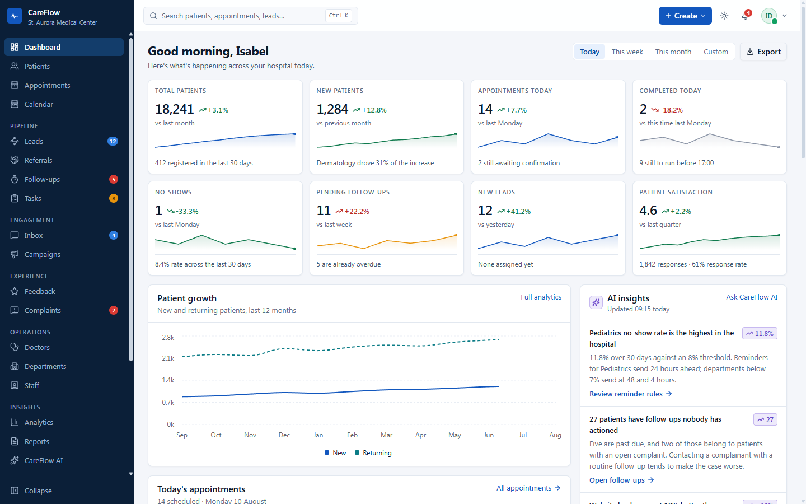
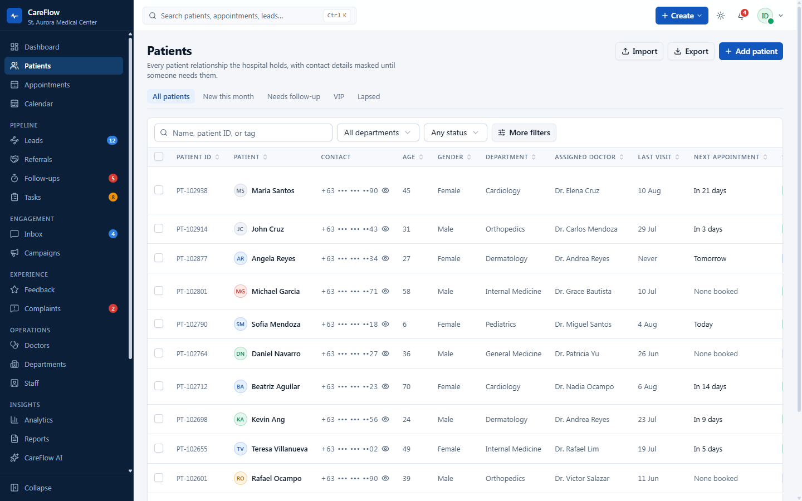
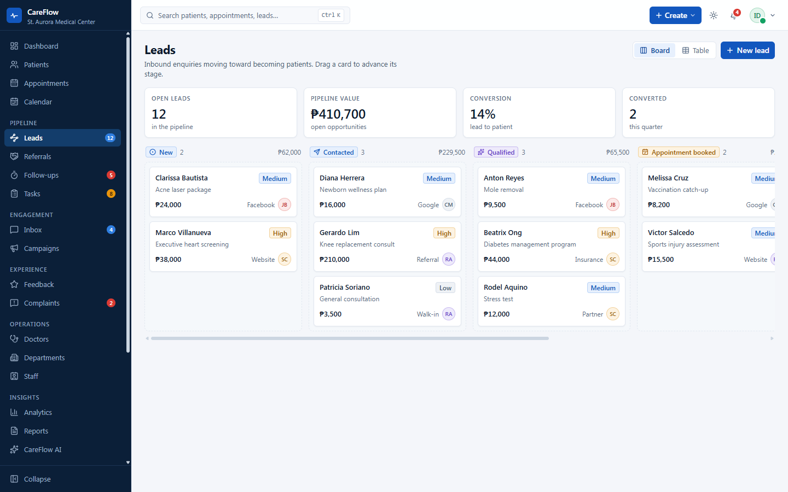
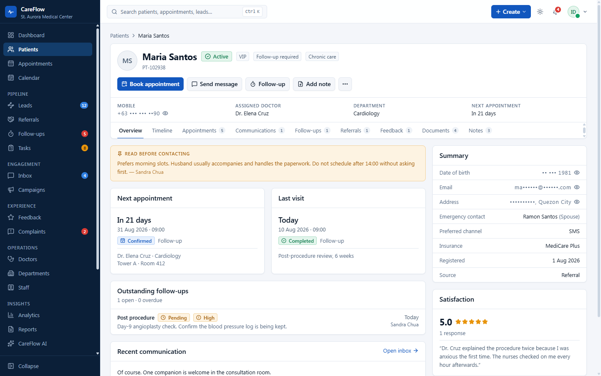
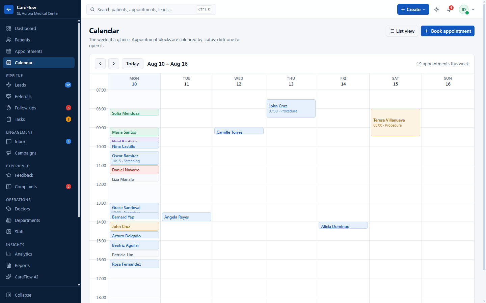
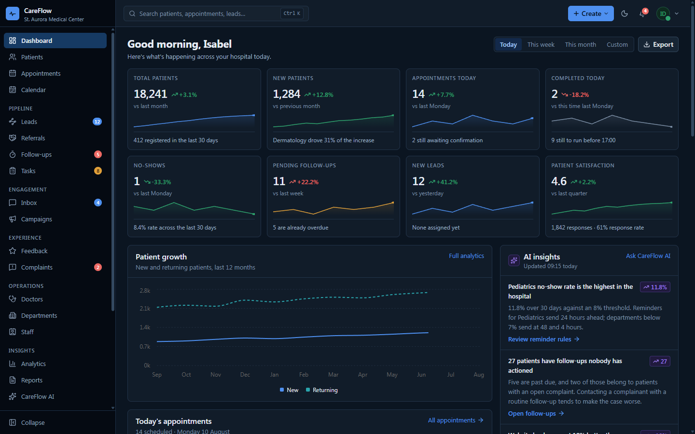

<div align="center">

# CareFlow CRM

**A hospital patient-relationship dashboard.**
37 screens covering patients, scheduling, pipeline, engagement, and administration.

[**View the live demo →**](https://crm-dashboard-beta-ebon.vercel.app)

[](https://crm-dashboard-beta-ebon.vercel.app)
[](https://nextjs.org)
[](https://react.dev)
[](https://www.typescriptlang.org)
[](https://tailwindcss.com)

</div>

[](https://crm-dashboard-beta-ebon.vercel.app)

---

## What this is

CareFlow sits beside a hospital's EMR and handles the relationship layer the EMR was never built
for: who is owed a follow-up, which acquisition channel converts, which complaint is about to
breach its SLA, and who looked at a patient's phone number.

The product is modelled on St. Aurora Medical Center, a fictional 320-bed hospital in Quezon
City. **Every record is invented.** No real patient information exists in this repository.

This is a front-end build. There is no server, no database, and no working authentication. See
[what is not built](#what-is-not-built).

---

## Two ideas worth a look

**Contact details stay masked, and revealing one is recorded.**

Phone numbers, emails, addresses, and dates of birth render masked everywhere. Revealing one
takes a deliberate click and writes an audit entry naming the field, the record, the actor, and
the time. The reveal and the audit write happen in a single state update, so a value cannot
become visible without its entry. `/admin/audit` reads the same log, so an action taken on the
patient list shows up there immediately.

Masks keep what staff need to triage and drop the rest. Address keeps the city so reception can
route a patient without seeing the street.

**One record anatomy, repeated.**

Patients, doctors, leads, appointments, campaigns, complaints, and workflows all use the same
detail layout: breadcrumb, identity, status chips, the facts you need before acting, actions,
then tabs. Learn the patient screen and the other six need no relearning.

The patient timeline is derived, not authored. Appointments, follow-ups, messages, tasks,
feedback, referrals, and notes merge into one chronology, so every patient has real history.

---

## Screens

| | |
|:--:|:--:|
|  |  |
| **Patients** · saved views, faceted filters, masked contact details | **Leads** · six-stage board, drag to advance |
|  |  |
| **Patient 360** · nine tabs on the shared record anatomy | **Calendar** · week grid, blocks coloured by status |

<details>
<summary><strong>Dark mode</strong></summary>



Light and dark are tuned as separate value sets rather than derived by inversion. A mechanical
flip put the navy rail within one step of the canvas and it stopped reading as its own surface.

</details>

---

## Features

**Command Center** — eight KPIs with sparklines and trend context, patient growth, today's
appointments, alerts for overdue work, AI insights, and the operational mix.

**Patients** — table with saved views, faceted filters, bulk messaging and tagging, export that
writes to the audit log, a three-step creation flow, and a nine-tab record.

**Scheduling** — appointment list scoped to today, upcoming, or past. Week calendar. Appointment
detail with check-in, reschedule, and cancel.

**Pipeline** — lead board across six stages with drag between them, plus a table view. Referrals,
follow-ups with overdue surfaced first, and tasks.

**Engagement** — inbox spanning SMS, email, WhatsApp, and logged calls, with internal notes kept
distinct from patient-visible messages. Campaigns with a delivery funnel.

**Experience** — feedback with sentiment split, and complaints tracked as cases against an SLA
with breaches surfaced on the list, the case, and the dashboard.

**Operations** — doctor roster and profiles, department comparison, staff directory.

**Insights** — full analytics surface, a report builder, and an AI console.

**Automation** — workflow list and a visual builder canvas showing triggers, conditions, actions,
and delays. Integration catalogue.

**Administration** — user management, a permission matrix across nine roles and seven areas, the
live audit log, security posture, and settings.

---

## Stack

| | |
|---|---|
| Framework | Next.js 16 (App Router, Turbopack) |
| UI | React 19, TypeScript 6 |
| Styling | Tailwind CSS 4 with a semantic token layer, no config file |
| Components | Radix primitives via shadcn/ui |
| State | zustand |
| Tables | TanStack Table 8 |
| Charts | Recharts 3 |
| Drag | dnd-kit |
| Flow canvas | xyflow |

Three dependencies are pinned deliberately. TypeScript stays on 6 because 7 outruns
typescript-eslint. ESLint stays on 9 because 10 breaks the bundled react plugin. TanStack Table
stays on 8 because 9 ships a rewritten API.

---

## Running it

```bash
git clone https://github.com/dooddles07/CRM-Dashboard.git
cd CRM-Dashboard
npm install
npm run dev
```

Open [localhost:3000](http://localhost:3000). No environment variables, no services to start.

```bash
npm run typecheck   # tsc --noEmit
npm run lint        # eslint
npm run build       # next build
```

Authentication is not wired, so any route is reachable directly. `/design-system` renders the
full token and component reference.

---

## Structure

```
app/
  (auth)/          login, forgot-password, mfa
  (app)/           every product screen, wrapped in the app shell
components/
  ui/              34 Radix/shadcn primitives
  shell/           rail, top bar, command palette, notifications
  data/            DataTable, Panel, PageHeader, KpiCard, charts
  healthcare/      StatusChip, Protected, PersonAvatar
  record/          RecordHeader, Spine
lib/
  types.ts         the domain model
  status.ts        status registries (icon, label, tone)
  format.ts        masking, dates, numbers
  store.ts         zustand store and the audit writer
  timeline.ts      the Spine builder
  data/            seed records
docs/
```

Three conventions to know before editing:

The demo clock is fixed at `2026-08-10`. Every date derives from it through `day()` or `at()`, so
the build renders identically on any calendar day. Never introduce `new Date()` into seed data or
into render.

Status always resolves through a registry in `lib/status.ts`, never a hand-written label or
colour. Adding a value to a status union without adding it to the registry is a type error.

Adding an entry to `lib/nav.ts` wires both the rail and the command palette.

---

## Documentation

| Document | Contents |
|---|---|
| [PRD](docs/PRD.md) | Problem, users, principles, scope, numbered requirements |
| [Architecture](docs/ARCHITECTURE.md) | Stack decisions, data flow, component contracts, constraints |
| [Design system](docs/DESIGN.md) | Tokens, type scale, component vocabulary |
| [Database](docs/DATABASE.md) | Domain model as built, and a proposed PostgreSQL schema |
| [API](docs/API.md) | Data-access layer as built, and a proposed REST contract |
| [Security](docs/SECURITY.md) | Current posture, built patterns, production requirements |
| [Changelog](docs/CHANGELOG.md) | What changed and when |

---

## What is not built

No server, database, or HTTP API. Seed data compiles into the bundle. State lives in memory and
resets on reload.

Authentication does not validate credentials. The screens exist; any route is reachable directly.

The AI console returns a canned answer rather than calling a model.

Client-side filtering holds at the current scale of tens to hundreds of records. A production
deployment moves it server-side well before the patient table reaches five figures.

Masking is presentational. The full value sits in the bundle, which is fine because the data is
fictional, and is exactly what [SECURITY.md](docs/SECURITY.md) says must change before anything
real goes near it.

---

## Verification

`tsc --noEmit` clean. `eslint` reports zero errors. `next build` succeeds across 37 routes, all
returning 200 with no console errors.

Playwright covers what static checks cannot: dragging a lead between stages moves the card and
recomputes both column totals, revealing a masked number writes an audit entry that appears at
the top of `/admin/audit`, create dialogs open from the URL and clear it on submit, and switching
density in Settings changes row padding across every table.

One lint warning is left visible on purpose. The React Compiler skips memoizing `useReactTable`
because TanStack returns functions it cannot safely memoize. Suppressing it would disable a rule
that catches real problems elsewhere.

---

## License

[MIT](LICENSE)
